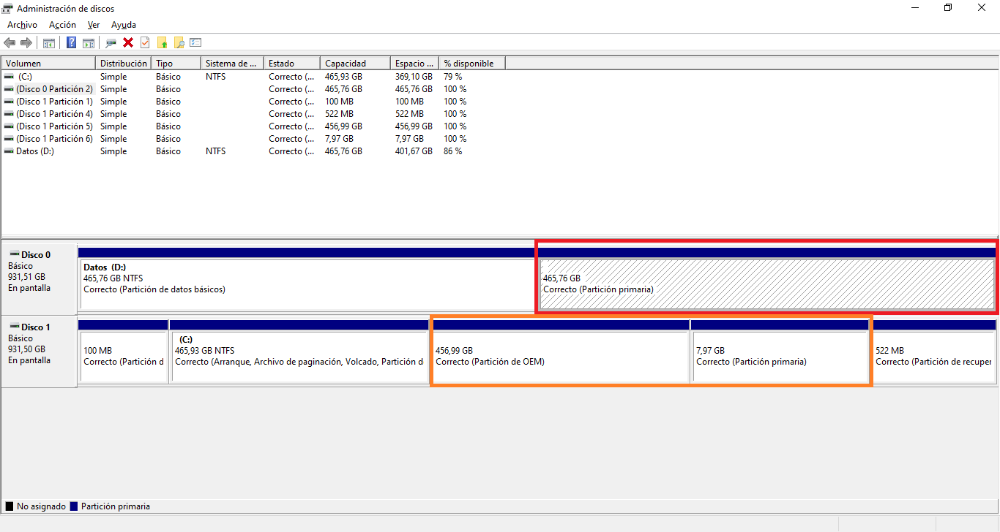
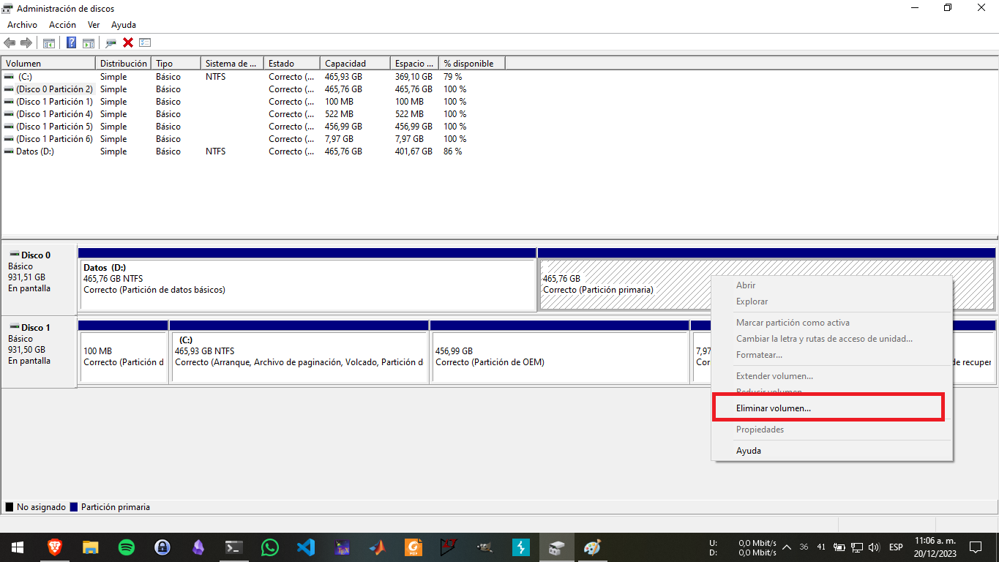
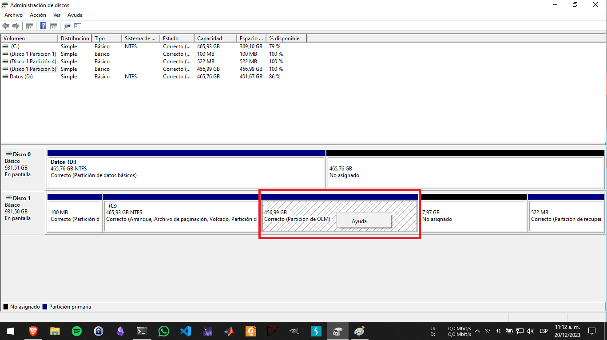
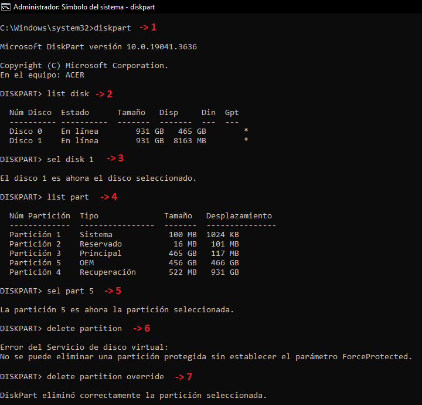
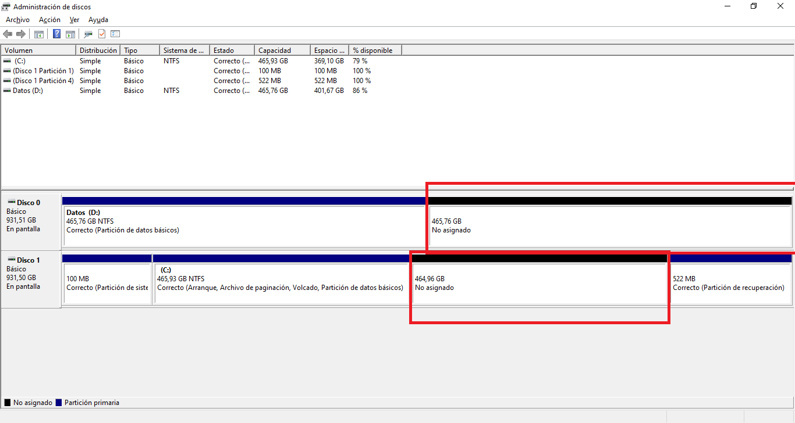
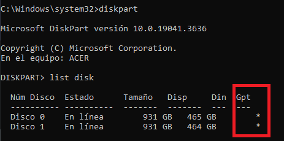
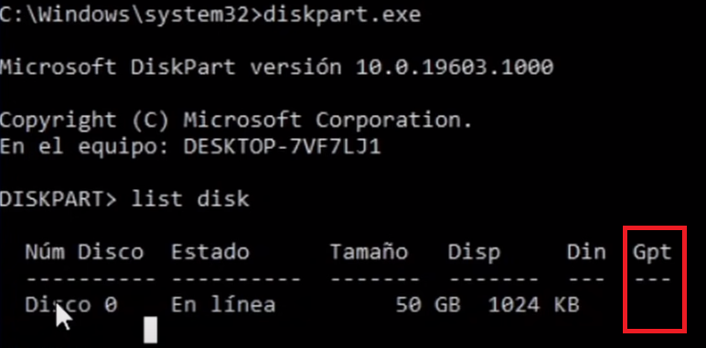
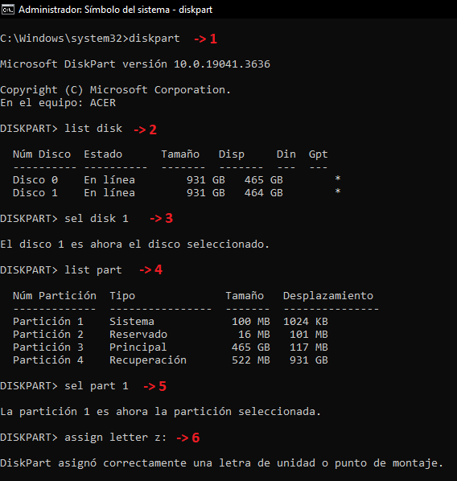
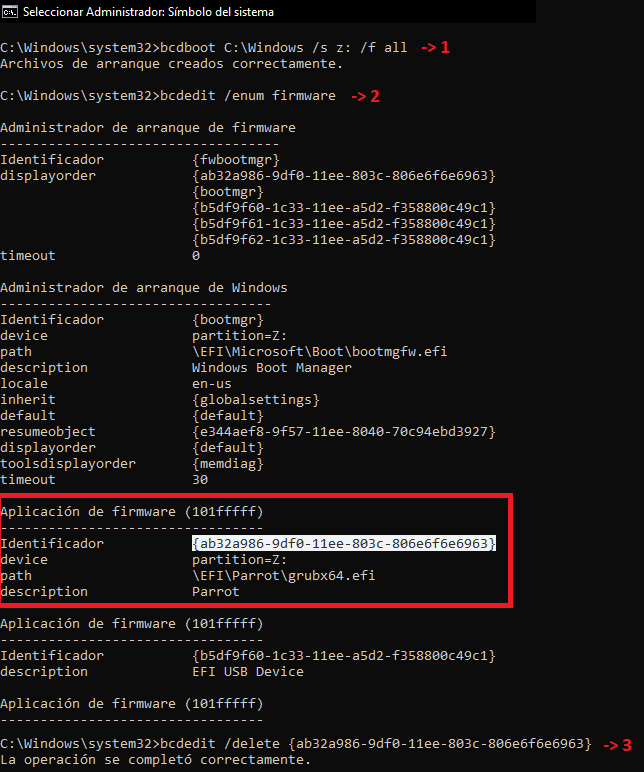
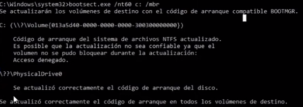

# Eliminación de las particiones correspondientes a Linux
En primer lugar se debe eliminar las particiones ocupadas por la distribución de Linux, esto se puede realizar desde el **administrador de discos** de Windows.

Por lo general las particiones que corresponden a Linux son aquellas que Window no logra identificar como formato NTFS o particiones de recuperación, en mi caso, las particiones seleccionadas corresponden a:
- Partición *raíz* (456.99 GB disco 1)
- Partición *home* (465.76 GB disco 0)
- Partición *swap* (7.97 GB disco 1)

Se procede a eliminarlas

En caso que la herramienta gráfica no deje eliminar una partición

Y este seguro que pertenece a Linux, se puede eliminar a través del *CMD* de Windows. Para ello se debe abrir el simbolo del sistema como ***ADMINISTRADOR*** y realizar el siguiente proceso.

1. Ejecutar el programa **diskpart** `diskpart`
2. Listar los discos del sistema `list disk`
3. Seleccionar el disco donde se encuentre la partición que no ha podido ser eliminada `sel disk <numero>` 
4. Listar las particiones del disco seleccionado `list part`
5. Seleccionar la partición que no ha podido ser eliminada `sel part <numero>`
6. Eliminar la partición seleccionada `delete partition`
7. Si se obtiene un error al eliminar la partición agregar el parámetro `overrride` `delete partition override`

En este punto las particones correspondientes a Linux habrán sido eliminadas 

## Identificación de tabla de particiones
Por último es necesario recrear los archivos de arranque de Windows desde el simbolo del sistema como ***ADMINISTRADOR*** y realizar un proceso dependiendo la tabla de particiones que use el disco, a continuación se muestra como identificar esto.

Desde el **CMD** de windows se ejecuta el programa `diskpart` y se muestra la lista de discos con `list disk`.

Si se muestra una un asterisco en la columna GPT como el la siguiente imágen, el disco usa tabla de particiones GPT y se debe seguir el proceso para [tabla de particiones GPT](#Tabla-de-particiones-GPT)

Si se muestra una un asterisco en la columna GPT como el la siguiente imágen, el disco usa tabla de particiones GPT y se debe seguir el proceso para [tabla de particiones MBR](#Tabla-de-particiones-MBR)

## Tabla de particiones GPT
Por último es necesario recrear los archivos de arranque de Windows en la partición EFI desde el simbolo del sistema como ***ADMINISTRADOR***. 

1. Ejecutar el programa **diskpart** `diskpart`
2. Listar los discos del sistema `list disk`
3. Seleccionar el disco donde se encuentre instalado el sistema operativo Windows `sel disk <numero>` 
4. Listar las particiones del disco seleccionado `list part`
5. Seleccionar la partición EFI (por lo general suele ser la primera y ocupa un tamaño de aproximadamente 100 MB, esta formateada como FAT32) `sel part <numero>`
6. Asignar una letra para trabajar posteriormente `assign letter <letra>:`

Fuera del programa `diskpart` se debe ejecutar los siguientes comandos como ***ADMINISTRADOR***

1. Recrear los archivos de arranque de Windows `bcdboot <ruta_donde_esta_instaladp_windows> /s <letra_asignada_a_la_particion_EFI>: /f all`
2. Buscar el hash de la distribución de Linux en la lista de sistemas operativos del sistema `bcdedit /enum firmware`
3. Eliminar la distribución de Linux de la lista de sistema operativos `bcdedit /delete <hash>`

## Tabla de particiones MBR
Por último es necesario recrear los archivos de arranque de Windows desde el simbolo del sistema como ***ADMINISTRADOR*** con el siguiente coamndo `bootsect /nt60 <unidad_donde_esta_instaladp_windows> /mbr`.

